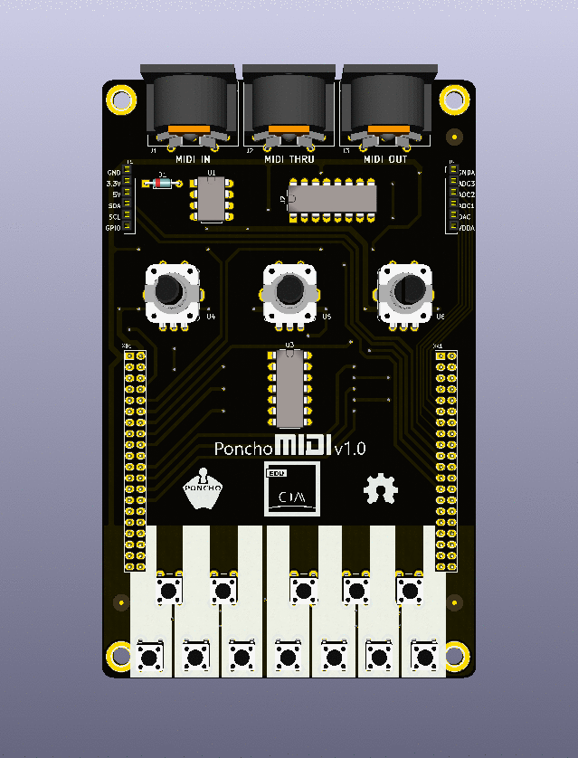
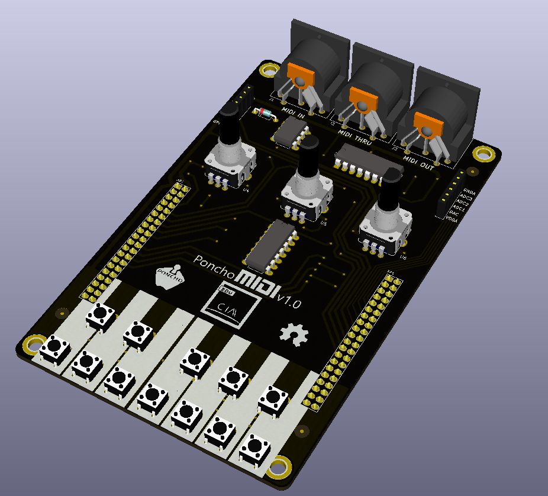
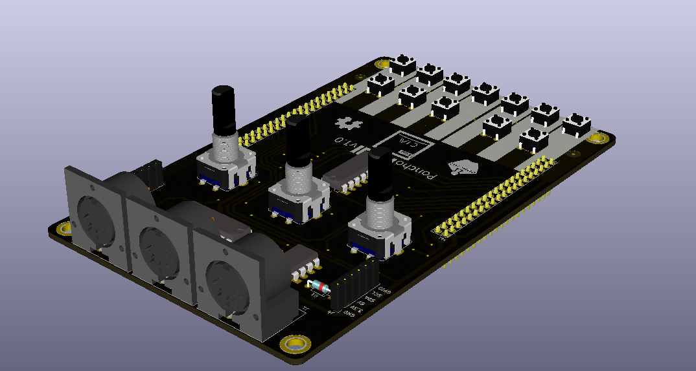
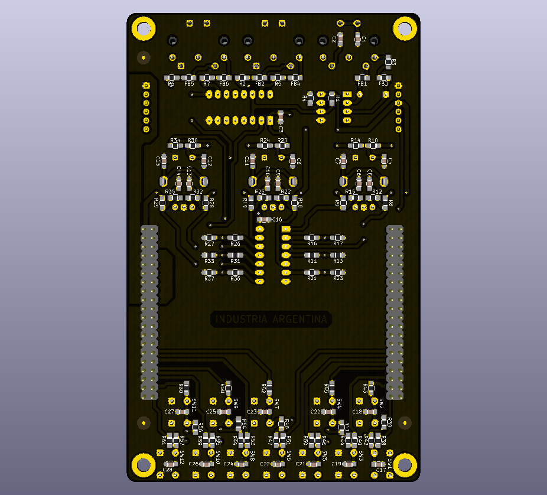

Poncho MIDI
===========
Poncho interfaz MIDI para la EDU-CIAA.

Este poncho fue diseñado con el objetivo de otorgar al proyecto CIAA de una interfaz MIDI acorde a las especificaciones eléctricas presentes en la _Especificación detallada del estándar MIDI 1.0_ y su posterior modificación en la _Actualización de Especificación Electrica (CA-033)_ del año 2014.

La documentación de las especificaciones citadas puede encontrarse en [Especificaciones Oficiales de la Asociación MIDI](https://www.midi.org/specifications).

Además de **12 pulsadores**, **3 encoders** (con pulsadores cada uno) y los **conectores para** las funcionalidades **MIDI IN**, **MIDI THRU** y **MIDI OUT**; se incluye un par de conectores tipo header para _stackear_ otros módulos para agregar funcionalidad a través de **_I2C_** o **entradas y salida analógicas** en caso de no poder acceder a conectores del tipo [Elevated socket](https://www.digikey.com/product-detail/en/samtec-inc/ESQ-120-14-G-D/SAM8767-ND/2640978) para fabricar el poncho y permitir otro nivel de _stacking_.

---

Releases
--------

* **v1.0**
  * Release inicial para fabricación de serie piloto para validación de diseño.

* **v0.9**
  * Primera y última versión del poncho manteniendo como requisito la posibilidad de manufactura casera y artesanal. Si bien su realización sería compleja, el circuito presenta vias redundantes para cambiar de capa y que eliminan la necesidad de utilizar orificios metalizados.

Requisitos de diseño
--------------------

* Requisitos comunes a todos:
  * Licencia abierta (se tiene que poder publicar los archivos KiCad y la funcionalidad del circuito).
  * Utilizar Kicad 4.0.x. 
  * Consolidar toda la documentación en forma organizada dentro del directorio de proyecto de KiCad.
  * Aplicar una licencia o aclarar el Copyright.
  * Considerar en cada caso, los aspectos vistos referente a documentación.
  * Realizar diseño jerárquico salvo en circuitos muy pequeños.
  * Siempre que sea posible, considerar para los diseños componentes que se consigan en el mercado local.
  * Se utilizará como proveedor de referencia a Mayer (para las reglas de diseño).
  * Indicar que tipo/calidad de placa se considera para el diseño, intentando siempre que sea posible, seleccionar la de menor costo. 

* Requisitos específicos:
  * Debe realizarse en un circuito de 2 capas.
  * Debe cumplir con los requerimientos y recomendaciones de **(CA-033) MIDI 1.0 Electrical Specification Update [2014]**, que modifica a **MIDI 1.0 Detailed Specification (Document Version 4.2)** en el apartado de hardware.
  * Debe contener conectores para funcionalidades: MIDI IN, MIDI THRU y MIDI OUT.
  * Debe integrar 12 interruptores SPST, NO y sin retención.
  * Debe integrar 3 encoders rotativos con interruptor SPST, NO y sin retención incluido.
  * Debe facilitar la utilización de los conversores A/D de la EDU-CIAA.
  * Debe facilitar la utilización del conversor D/A de la EDU-CIAA.
  * Debe ocupar, como máximo, la superficie del poncho grande.

Asignación de pines
-------------------

| Elemento	| Nombre EDU-CIAA	| Puerto	|
| ------------- |:---------------------:|:-------------:|
| pulsador 0 	| GPIO8			| P6_12		|
| pulsador 1 	| GPIO7			| P6_11		|
| pulsador 2 	| GPIO5			| P6_9		|
| pulsador 3	| GPIO3			| P6_7		|
| pulsador 4	| GPIO1			| P6_4		|
| pulsador 5	| LCD1  		| P6_4		|
| pulsador 6	| CAN_TD 		| P3_2 		|
| pulsador 7	| T_COL1 		| P7_4 		|
| pulsador 8	| T_FIL0 		| P4_0 		|
| pulsador 9	| T_FIL3 		| P4_3 		|
| pulsador 10	| T_FIL2 		| P4_2 		|
| pulsador 11	| T_COL0 		| P1_5 		|
| encoder0_sw	| CRS_DV		| P1_16 	|
| encoder1_sw	| MDIO			| P1_17 	|
| encoder2_sw	| TXD0			| P1_18 	|
| encoder0_A	| SPI_MISO		| P1_3 		|
| encoder0_B	| TXD1 			| P1_20 	|
| encoder1_A	| LCD4 			| P4_10 	|
| encoder1_B	| LCD_RS 		| P4_8 		|
| encoder2_A	| LCD_3 		| P4_6 		|
| encoder2_B	| LCD_2 		| P4_5 		|
| MIDI_IN	| RS232_RXD		| P2_4 		|
| MIDI_OUT	| RS232_TXD		| P2_3 		|

Los puertos de expansión son una extensión sin cambios de la asignación de la EDU-CIAA.

Figuras
-------

